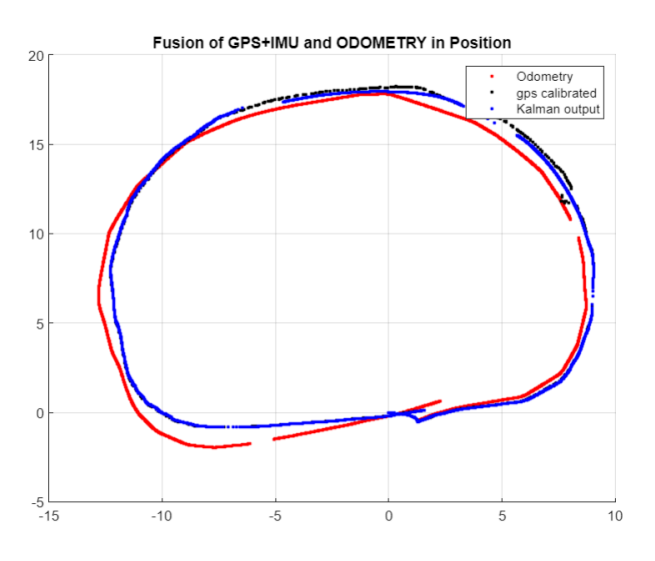
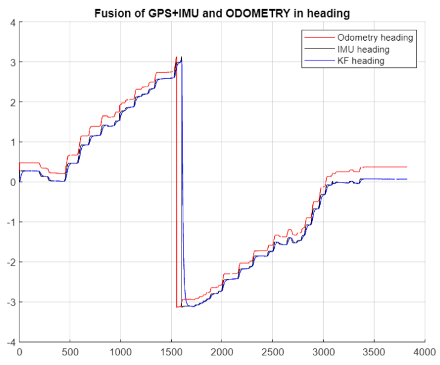
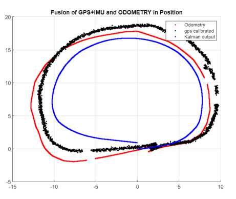
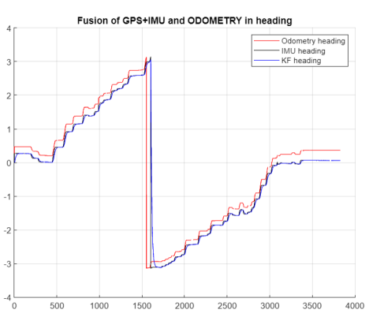
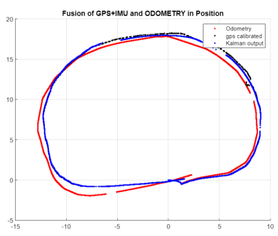
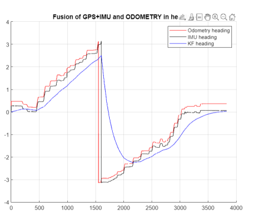
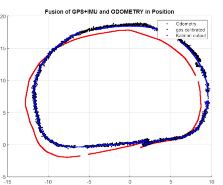
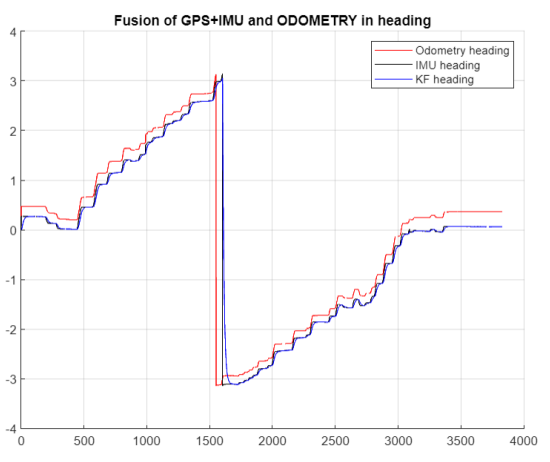

# Mobile Robot Localization using Kalman Filter

## Description

This project involves designing and implementing a Kalman filter to fuse data from GPS, IMU, and Wheel Encoder sensors to achieve a smooth and accurate pose (position and orientation) estimation of a mobile robot. The data used in this project is collected from a real/physical Novatel DGPS, Microstrain IMU 3DM-GX2, and Seekur robot encoders.

### Objectives

**Design the Kalman Filter**:
   - Fuse GPS, IMU, and Wheel Encoder data to output a smooth and more accurate pose (position and orientation) of the robot.

## Implementation Details

- **Programming Language**: Matlab

## How It Works

1. **Initialization**:
   - Initialize the Kalman Filter with the appropriate state and covariance matrices.
   - Load and preprocess the sensor data (GPS, IMU, and Wheel Encoder).

2. **Kalman Filter Algorithm**:
   - Implement the prediction and update steps of the Kalman Filter.
   - Fuse the sensor data to estimate the robot's position and orientation.

3. **Noise Addition and Analysis**:
   - Add Gaussian noise to the GPS and IMU covariance data and analyze the effects on the Kalman Filter output.
   - Plot the results and provide a detailed explanation of the observations.

## Results

### Static Sensor Network
*Reporting the KF results*

 
 
*Adding noise to the GPS covariance data*

 
 
Adding noise to the IMU covariance data.*

 
 

### Dynamic Sensor Network
*Adding noise to the GPS position data with changed covariance*

 
 

### Conclusion

**Mobile Robot Localization using Kalman Filter** demonstrates the effectiveness of the Kalman Filter in fusing sensor data to achieve accurate localization. By analyzing the effects of added noise, this project provides insights into the robustness and performance of the Kalman Filter in real-world scenarios.
