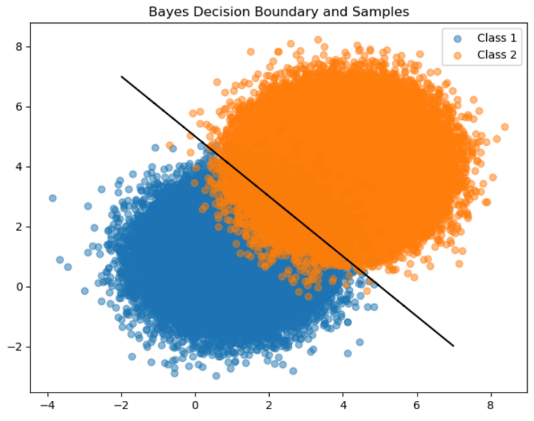
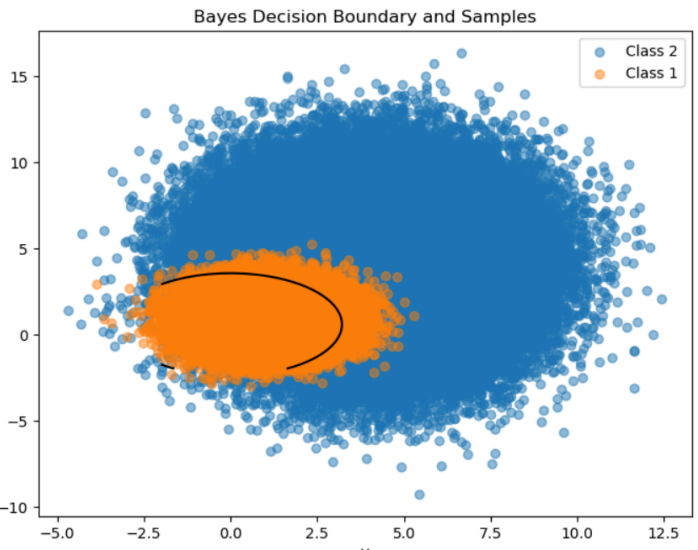

## Pattern Recognition - 2 Class Classification

Consider a two-class classification problem where the data of each class is modeled by a
2D Gaussian density N(μ1,Σ1) and N(μ2,Σ2).

### Data Generation

Using the parameters shown below, generate 60,000 random samples from N(μ1,Σ1) and 140,000 samples from N(μ2,Σ2) (i.e., 200,000 samples total). We will be referring to this data set as “data set A”.

- Parameters for N(μ1,Σ1):
  - Mean (μ1): [insert mean values here]
  - Covariance matrix (Σ1): [insert covariance matrix here]

- Parameters for N(μ2,Σ2):
  - Mean (μ2): [insert mean values here]
  - Covariance matrix (Σ2): [insert covariance matrix here]

Use the Box-Muller transformation to generate the samples from each distribution.

### Visualization

#### Image 1: Bayes Decision Boundary and Data Set A

Both the Bayes decision boundary and the samples from data set A are plotted to better visualize how the Bayes rule would classify the data in this case.

#### Image 2: Theoretical Probability Error

Repeated the experiment from image 1 but using data set B and calculated the theoretical probability error (e.g., Bhattacharyya bound).

